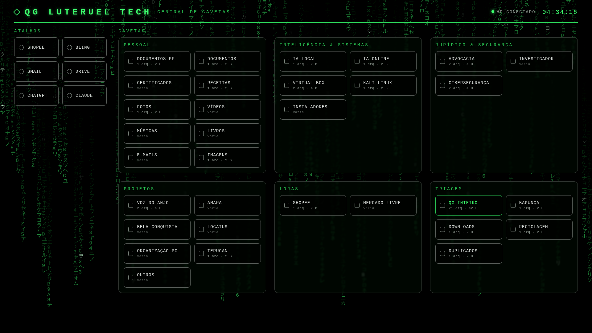

# Painel de Gavetas — QG LUTERUEL TECH

Papel de parede interativo no estilo Matrix, com todas as gavetas do HD como botões. Um clique abre a pasta no Explorador de Arquivos.

## Instalar (uma vez só)

1. Deixe todos os arquivos desta pasta juntos no PC (fora do HD externo).
2. Dê dois cliques em `INSTALAR_GAVETAS.bat` e escolha **1**.
   - Se o Windows avisar, clique em **Mais informações → Executar assim mesmo**.
   - O painel abre no navegador. A partir daí o servidor liga sozinho sempre que o Windows iniciar, sem janela.
3. Abra o **Lively Wallpaper** e **arraste o arquivo `QG-Gavetas-Lively.zip`** para dentro dele. Depois clique no novo papel de parede **QG Gavetas** para aplicar.

## Como funciona

- Cada botão abre a gaveta correspondente dentro de `QG LUTERUEL TECH`, no HD externo.
- A letra do HD é encontrada sozinha (I:, E:, F:...).
- Cada botão mostra quantos arquivos a gaveta tem e quanto espaço ocupa (atualiza a cada 5 minutos).
- No topo aparece se o HD está **conectado** ou **desconectado**.
- Os **atalhos** (Shopee, Bling, Gmail, Drive, ChatGPT, Claude) abrem no navegador padrão.
- Gaveta que ainda não existe é criada no primeiro clique.

## Segurança

- O servidor só aceita conexões do próprio PC (127.0.0.1). Ninguém da rede ou da internet acessa.
- Só abre pastas dentro de `QG LUTERUEL TECH` e só abre sites `http`/`https`.
- Não apaga nem move nada.

## Remover

`INSTALAR_GAVETAS.bat` → opção **2**.
